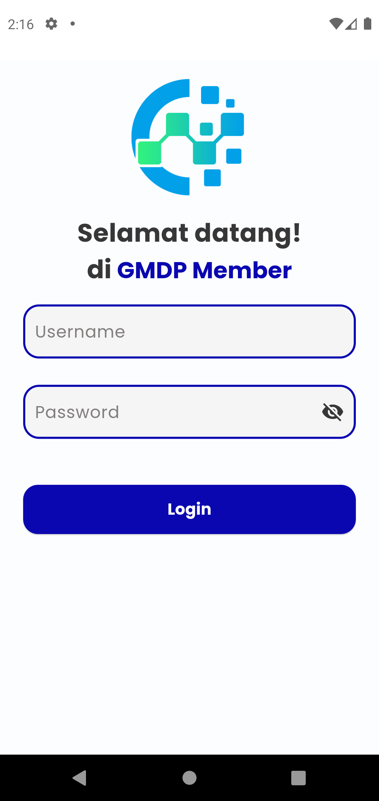
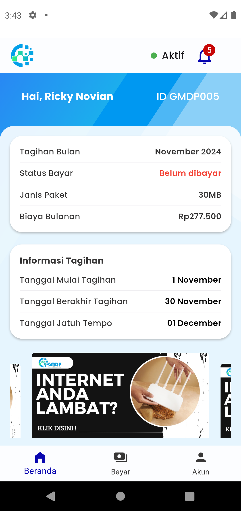
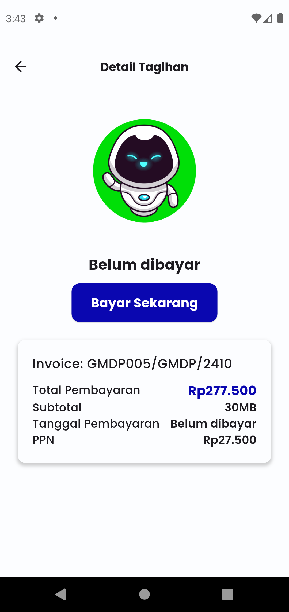
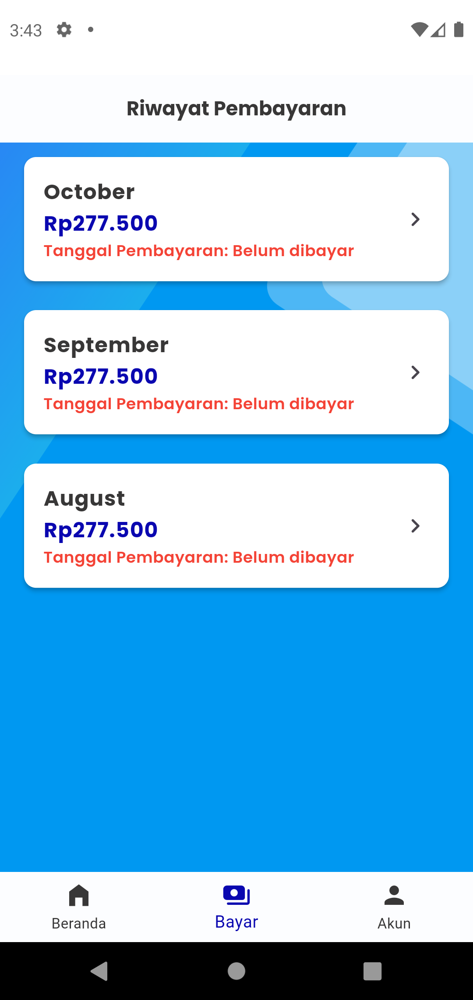
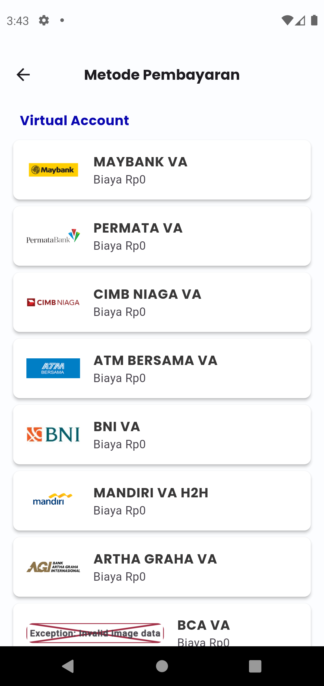
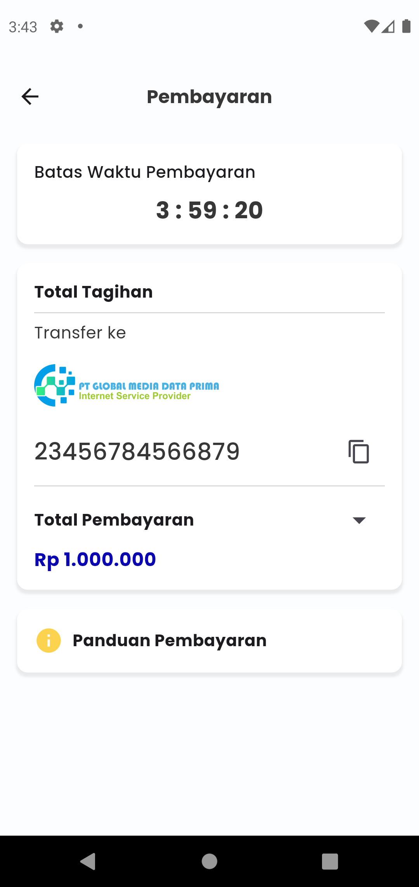

    <h1 align="center">Billing ISP Mobile</h1>

# Apa ini?

<h4 align="center">
Aplikasi Berbasis Android dengan fitur Pembayaran Tagihan (bagi pelanggan) dan Pengelolaan Pelanggan (bagi penyedia jasa) untuk usaha INTERVET SERVICE PROVIDER (ISP)
</h4>
 

# Screenshoot
#### Data yang kami tampilkan adalah data DUMMY atau PALSU
<table>
    <tr>
        <td></td>
        <td></td>
        <td></td>
    </tr>
</table>
<table>
    <tr>
        <td></td>
        <td></td>
        <td></td>
    </tr>
</table>
<table>
    <tr>
        <td></td>
        <td></td>
        <td></td>
    </tr>
</table>

# Informasi Penting
- Informasi eBilling kami jelaskan pada repository berikut [Billing ISP](https://github.com/GMDP-Developers/Billing-ISP)
- Ini adalah Aplikasi Android Tambahan yang kami fokuskan ke pelanggan, supaya tidak perlu lagi membuka website. Hanya cukup dengan Aplikasi Mobile
- Kami akan rilis Aplikasi Mobile pada tanggal **___1 Desember 2024___**

<table>
    <tr>
        <td></td>
        <td></td>
        <td></td>
        <td></td>
        <td></td>
    </tr>
</table>

<!-- https://piclod.com/i/1703558312/Addicts_before_and_after_.png -->

# Contact
Jika pertanyaan Anda belum terjawab di sini, silakan hubungi kami melalui kontak yang tersedia!
#### Silahkan Email ke `info@gmdp.net.id` atau `reno@gmdp.net.id` untuk informasi lebih lengkap
